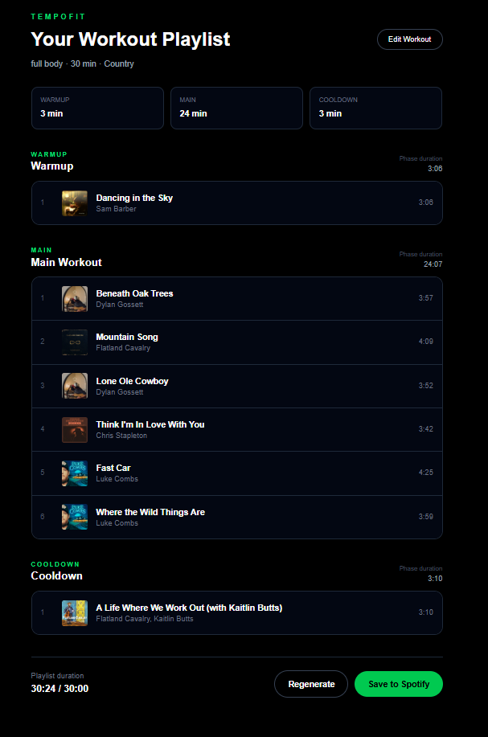

# TempoFit

TempoFit is a Spotify-integrated workout playlist generator that creates personalized playlists based on a user's workout, desired duration, and music preferences.

Instead of manually building a playlist before exercising, users describe their workout in natural language, choose a target duration, and TempoFit generates a structured playlist with **Warmup, Main Workout, and Cooldown** phases.



## Explore the Project
A visual walkthrough of the product strategy, user experience, architecture, technical constraints, testing, and key decisions behind TempoFit.

[View the TempoFit Product Case Study](docs/TempoFit-Product-Case-Study.pdf)

## What It Does

TempoFit allows users to:

- Connect their Spotify account using OAuth
- Select preferred music genres
- Choose between more familiar music and more discovery-focused recommendations
- Describe a workout in natural language
- Set a target workout duration
- Generate a playlist structured around workout phases
- Regenerate the playlist for a different result
- Preview tracks, artists, album artwork, and durations
- Save the finished playlist directly to Spotify

## Product Decisions

TempoFit was designed as a focused MVP rather than a production-scale music recommendation platform.

The primary user problem is simple:

> People often reuse static workout playlists or spend time manually selecting music that may not match the type or duration of their workout.

The core user story is:

> As a Spotify user, I want to describe my workout in normal language and receive a personalized playlist matching my workout and its duration so that I don't have to manually select appropriate music.

The MVP intentionally focuses on one complete workflow:

**Connect Spotify → Set Preferences → Describe Workout → Generate → Preview → Save to Spotify**

Features such as Apple Music support, social sharing, wearable integration, machine-learning recommendations, and native mobile applications were intentionally kept outside the MVP scope.

## How It Works

TempoFit converts the user's workout description into a structured workout profile containing information such as:

- Workout type
- Muscle/body focus
- Intensity
- Music genre
- Target duration
- Warmup duration
- Main workout duration
- Cooldown duration

For example:

```text
Input:
"30-minute full-body strength workout with moderate intensity.
Keep me motivated with country music throughout the workout."

Workout Profile:
Type: Strength
Focus: Full Body
Intensity: Moderate
Genre: Country
Duration: 30 minutes

Phases:
Warmup: 3 minutes
Main Workout: 24 minutes
Cooldown: 3 minutes
```

TempoFit then retrieves Spotify track candidates, builds each workout phase, and attempts to match the requested total duration while preserving the phase structure.

## System Architecture

```text
User
  ↓
Next.js Interface
  ↓
Workout Parser
  ↓
Structured Workout Profile
  ↓
Spotify Candidate Retrieval
  ↓
Playlist Generation Engine
  ↓
Duration Matching
  ↓
Playlist Preview
  ↓
Spotify Web API
  ↓
Saved Spotify Playlist
```

Music preferences are stored locally in the browser for the MVP, while Spotify authentication and playlist operations are handled through server-side API routes.

## Tech Stack

**Frontend**
- Next.js
- React
- TypeScript
- Tailwind CSS

**Backend / Integration**
- Next.js API Routes
- Spotify Web API
- Spotify OAuth 2.0

**Product & Design**
- Jira
- Confluence
- Figma

**Development**
- Git
- GitHub
- VS Code

## Key Technical Challenges

### Spotify OAuth and Token Refresh

TempoFit uses Spotify OAuth to authenticate users and request the permissions needed to create private playlists.

Spotify access tokens expire, so the application also implements a refresh-token flow. If a Spotify request receives an authentication failure, TempoFit can request a new access token and retry the operation without requiring the user to reconnect manually.

### Playlist Duration Matching

A workout playlist should approximately match the length of the workout.

The playlist engine divides the target duration across the Warmup, Main Workout, and Cooldown phases and selects tracks while attempting to minimize the difference between the requested and generated durations.

During MVP testing, generated playlists generally landed within approximately two minutes of the requested workout duration.

### Familiar vs. Discover Personalization

Users can control whether they want more recognizable music or more discovery-focused selections.

For the MVP, this is implemented using curated artist pools rather than a machine-learning recommendation system. The slider changes the weighting between familiar and less-obvious artists before the playlist-generation engine selects tracks.

This approach keeps the recommendation logic understandable and deterministic while still giving users meaningful control over playlist variety.

### Spotify API Constraints

Spotify's current Development Mode restrictions limit access to some recommendation and audio-analysis functionality.

Because TempoFit cannot depend on Spotify audio-feature data such as track energy or BPM for this MVP, playlist generation uses available track metadata, genre preferences, curated artist pools, workout structure, and duration-based heuristics.

Rather than adding unnecessary infrastructure or an external recommendation service, the MVP was designed around the capabilities reliably available through the Spotify Web API.

## Testing

The MVP was tested across different workout types, genres, preference settings, and target durations.

Example results:

| Test | Target | Generated |
|---|---:|---:|
| Strength / Rap | 45:00 | 42:59 |
| Cardio / Indie | 45:00 | 43:53 |
| High-Intensity / EDM | 30:00 | 29:57 |
| General Workout | 15:00 | 15:16 |
| General Workout — Regenerated | 15:00 | 14:24 |
| Full Body / Country | 30:00 | 30:24 |

Testing also verified Spotify authentication, automatic token refresh, playlist regeneration, Familiar/Discover weighting, phase generation, and saving playlists to Spotify.

## MVP Scope

TempoFit was intentionally built as a portfolio MVP focused on product thinking, system design, API integration, and recommendation logic.

### Included

Spotify authentication, workout parsing, music preferences, playlist generation, workout phases, duration matching, playlist preview, regeneration, and Spotify playlist creation.

### Not Included

Apple Music, native mobile applications, social features, wearable integrations, production infrastructure, machine-learning recommendations, or public deployment.

## Known Limitations

- Spotify Development Mode limits the Spotify accounts that can authenticate with the application.
- Musical energy and BPM are not directly analyzed.
- Familiar/Discover recommendations use curated artist groups rather than individual listening-history models.
- Workout parsing is rule-based rather than powered by an LLM.
- Preferences are stored in browser storage rather than a persistent database.
- Playlist duration matching is approximate.

These were deliberate MVP tradeoffs intended to keep the system small, understandable, and focused on validating the core user experience.

## Running Locally

Clone the repository:

```bash
git clone https://github.com/meghnanimmala/tempofit.git
cd tempofit
npm install
```

Create a `.env.local` file with your Spotify application credentials:

```text
SPOTIFY_CLIENT_ID=your_client_id
SPOTIFY_CLIENT_SECRET=your_client_secret
SPOTIFY_REDIRECT_URI=http://127.0.0.1:3000/callback
```

Then start the development server:

```bash
npm run dev
```

Open:

```text
http://127.0.0.1:3000
```

A Spotify Developer application configured with the matching redirect URI is required.

## Project Goal

TempoFit was built to explore the intersection of **product management and software engineering**: defining an MVP, designing the user experience and system architecture, working within third-party API constraints, implementing integrations, testing the complete workflow, and documenting technical tradeoffs.

Development used AI-assisted coding as part of the implementation workflow, while product requirements, architecture decisions, API behavior, testing, debugging, and feature tradeoffs were actively reviewed and understood throughout the project.
